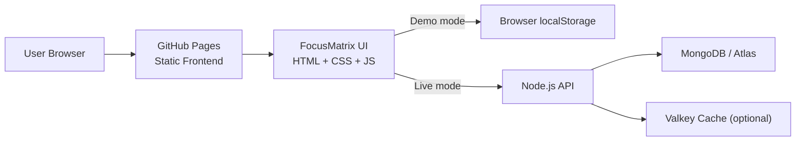
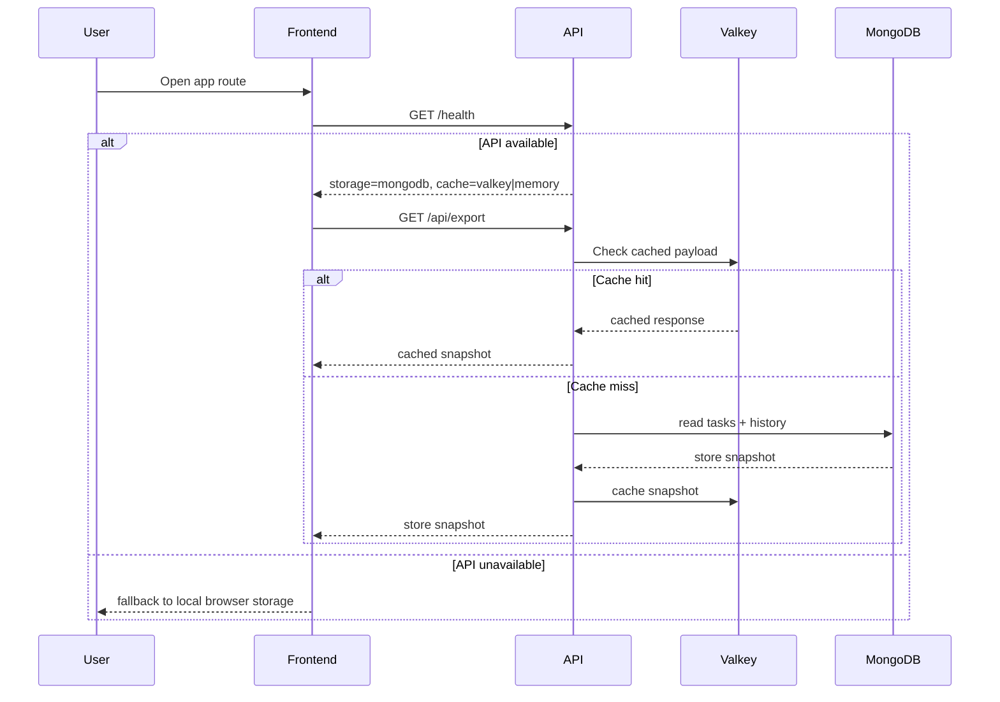
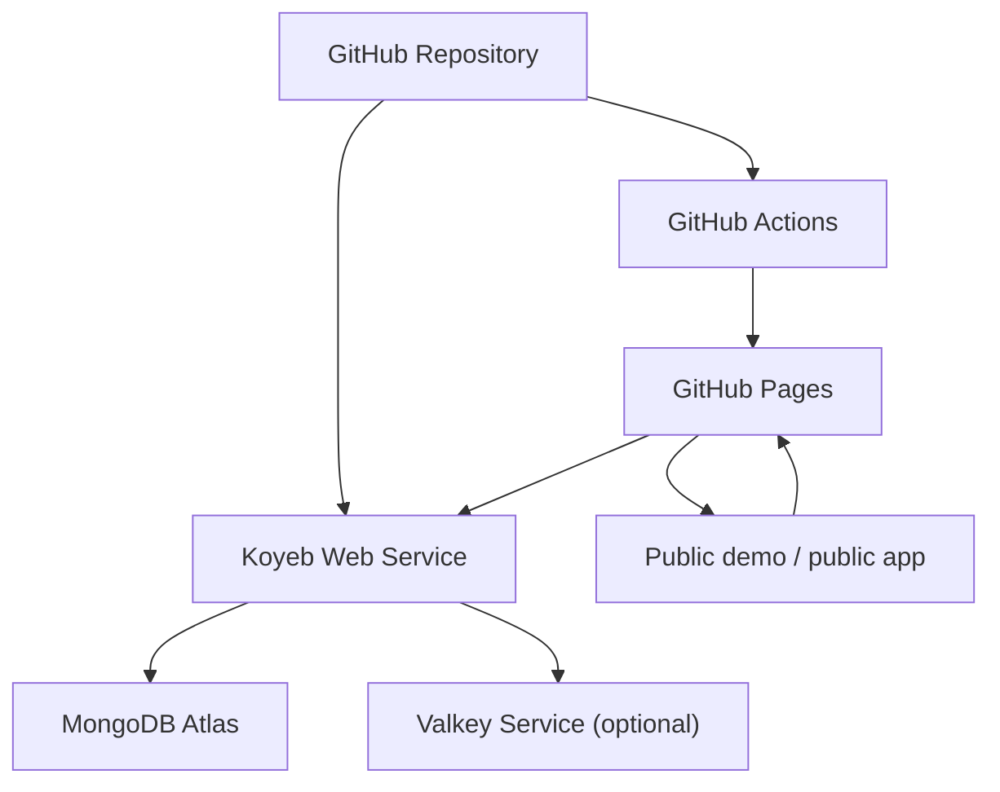

# FocusMatrix Architecture

This document is the working source of truth for how the current app is structured and how the hosted version should be assembled.

## System Overview

## Runtime Flow

## Deployment Topology

## Components

- Frontend:
  - `index.html` is the public route selector
  - `prototype/` is the safe demo route
  - `app/` is the backend-ready route
  - `config/runtime-config.js` is the deployment-time frontend API switch
- Backend:
  - `backend/src/server.js` exposes the HTTP API
  - `backend/src/providers/mongoStore.js` is the MongoDB data provider
  - `backend/src/providers/jsonStore.js` is the local fallback provider
  - `backend/src/cache.js` adds optional Valkey caching
- Infrastructure:
  - GitHub Pages serves the static frontend
  - Koyeb can host the Node backend
  - MongoDB Atlas can host the durable database
  - Valkey can accelerate cacheable API reads

## Current Modes

- Demo mode:
  - `prototype/`
  - browser-only storage
  - safest route for demos
- Local app mode:
  - `app/`
  - local backend through `backend/run-local.cmd`
  - Mongo-backed persistence
- Hosted app mode:
  - `app/`
  - GitHub Pages frontend
  - public API URL configured in `config/runtime-config.js`
  - Koyeb + Atlas + optional Valkey
